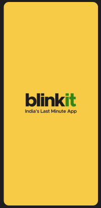

# 🚀 Blinkit Clone App (Flutter)

A clean and fast UI clone of the Blinkit App made using Flutter.

---

## 📸 App UI Screenshots

<table>
  <tr>
    <td></td>
    <td></td>
    <td></td>
  </tr>
  <tr>
    <td></td>
    <td></td>
    <td></td>
  </tr>
</table>

---

## 🛠️ Built With

- **Flutter** – Fast UI toolkit for building beautiful native apps
- **Dart** – Programming language for Flutter

---

## 👨‍💻 Developer

Made with ❤️ by **Sanskar Yadav**  
[LinkedIn](https://www.linkedin.com/in/your-profile) • [GitHub](https://github.com/yadavsanskar591)

---

